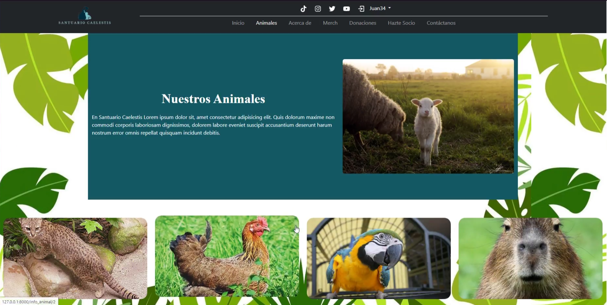
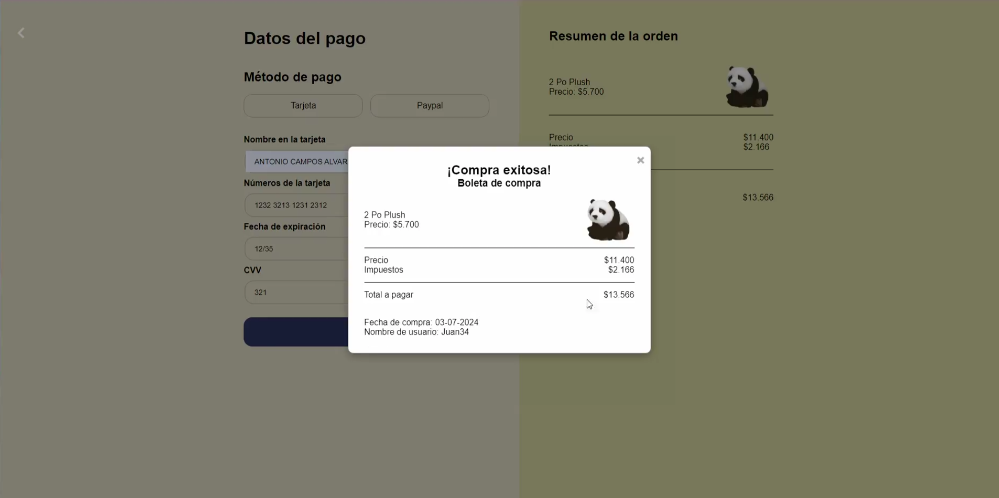
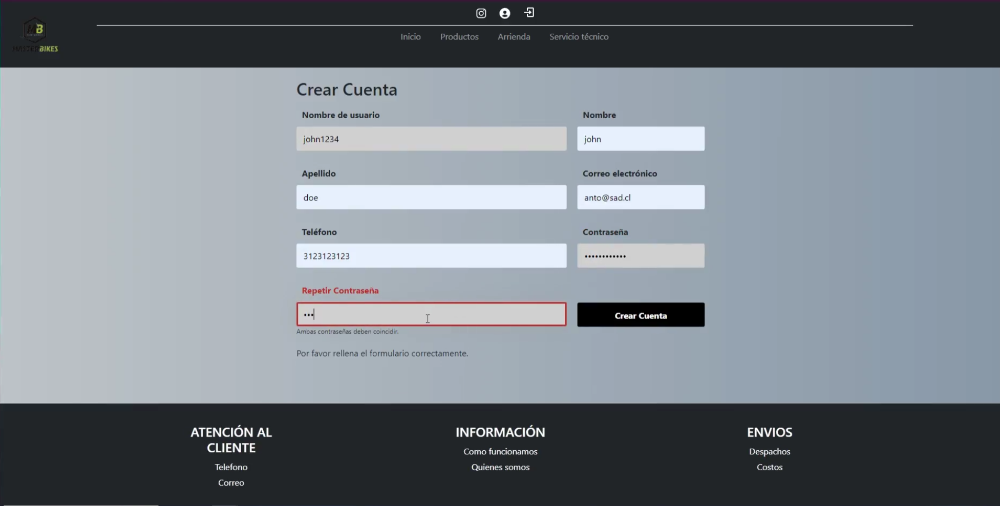

# 🐾 Caelestis Web Platform – Animal Sanctuary System

Caelestis Web Platform es una **plataforma web integral para un santuario de animales**, diseñada para gestionar **membresías, donaciones y compras en línea**, junto con autenticación de usuarios y flujo completo de pago.

El sistema centraliza procesos que normalmente se manejan de forma manual, ofreciendo una experiencia moderna tanto para usuarios como para la administración del santuario.

## Descripción General

La plataforma permite a los usuarios:
- Registrarse e iniciar sesión
- Realizar donaciones en línea
- Suscribirse a membresías
- Comprar productos (merchandising)
- Visualizar confirmaciones de pago y boletas
- Contactar al santuario mediante formularios

El proyecto está orientado a **entornos reales**, combinando experiencia de usuario, lógica de negocio y persistencia de datos.

## 🎯 Problema y Solución

### Problema
- Donaciones y aportes gestionados manualmente  
- Falta de trazabilidad en pagos y membresías  
- Escasa automatización en la gestión de usuarios  
- Experiencia poco intuitiva para los donantes  

### Solución
- Plataforma web centralizada  
- Flujo de pago digital con confirmación  
- Gestión de usuarios y membresías  
- Automatización de donaciones y compras  

## Demostracion

## Funcionalidades Principales

- Registro e inicio de sesión de usuarios  
- Donaciones con tarjeta de crédito y otros medios  
- Sistema de membresías (Bronce, Plata, Oro)  
- Tienda online con carrito y resumen de compra  
- Confirmación de pago y boleta digital  
- Formularios de contacto  
- Gestión de datos desde base de datos  

## 🛠️ Tecnologías Utilizadas

- **Frontend:** HTML, CSS, JavaScript  
- **Backend:** Framework web (orientado a lógica de negocio y persistencia)  
- **Base de datos:** Sistema relacional / estructurado  
- **Pagos:** Flujo de pago simulado / integrado  
- **Control de versiones:** Git & GitHub  

## 🧠 Flujo del Sistema

1. El usuario se registra o inicia sesión  
2. Navega por el sitio (animales, tienda, membresías)  
3. Realiza una donación, compra o suscripción  
4. Ingresa datos de pago  
5. El sistema valida la operación  
6. Se muestra confirmación y boleta de compra  

